# CoToLive 产品报告
源代码位于 [https://github.com/iiinotlll/CoToL].

## 产品功能介绍
本产品名为 CoToLive（Coffee，Code，Cooperate To Live），是一个**前后端分离的、支持云端存储的同步笔记**。
用户的所有笔记内容都可以上传至服务器保存，并且在需要的时候进行增删改查。

用户可以在**注册**并**登录**系统后，**创建**、**修改**和**删除**笔记。

### 注册
用户点击 “注册” 按钮即可以开始注册。注册成功后即有弹窗提示。

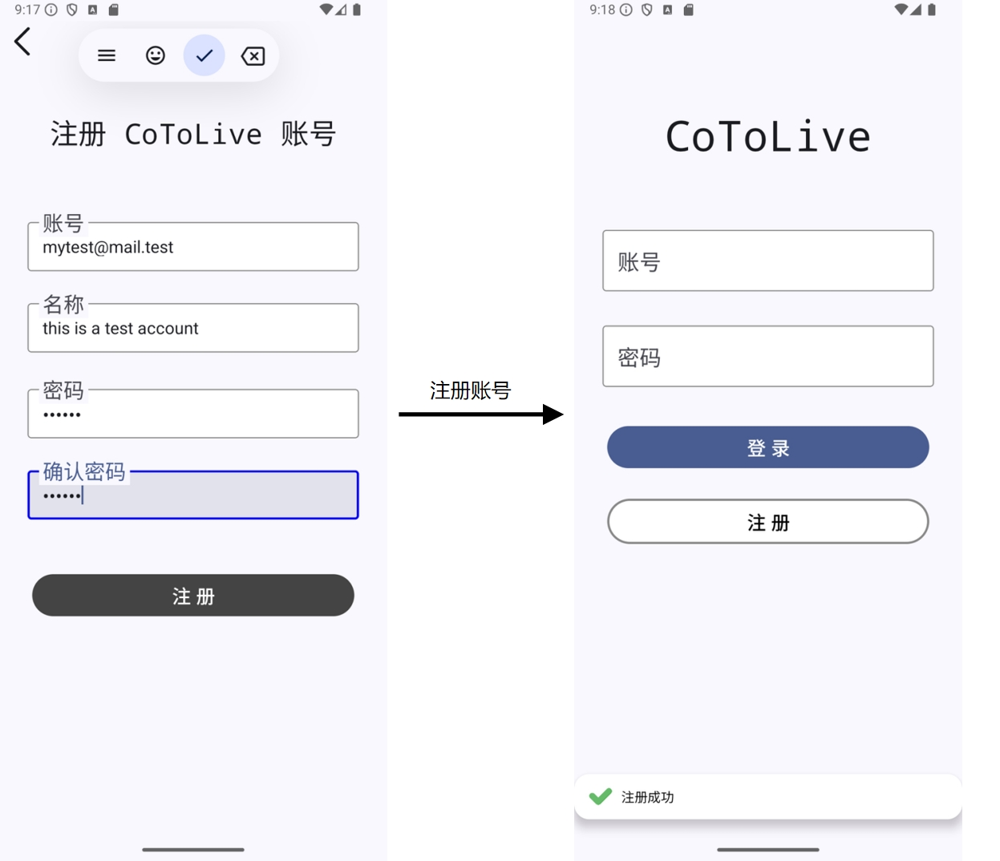

### 登录 & Home 界面预览
用户利用注册信息登录，点击 “登录” 按钮，进入 Home 界面，进行笔记预览。

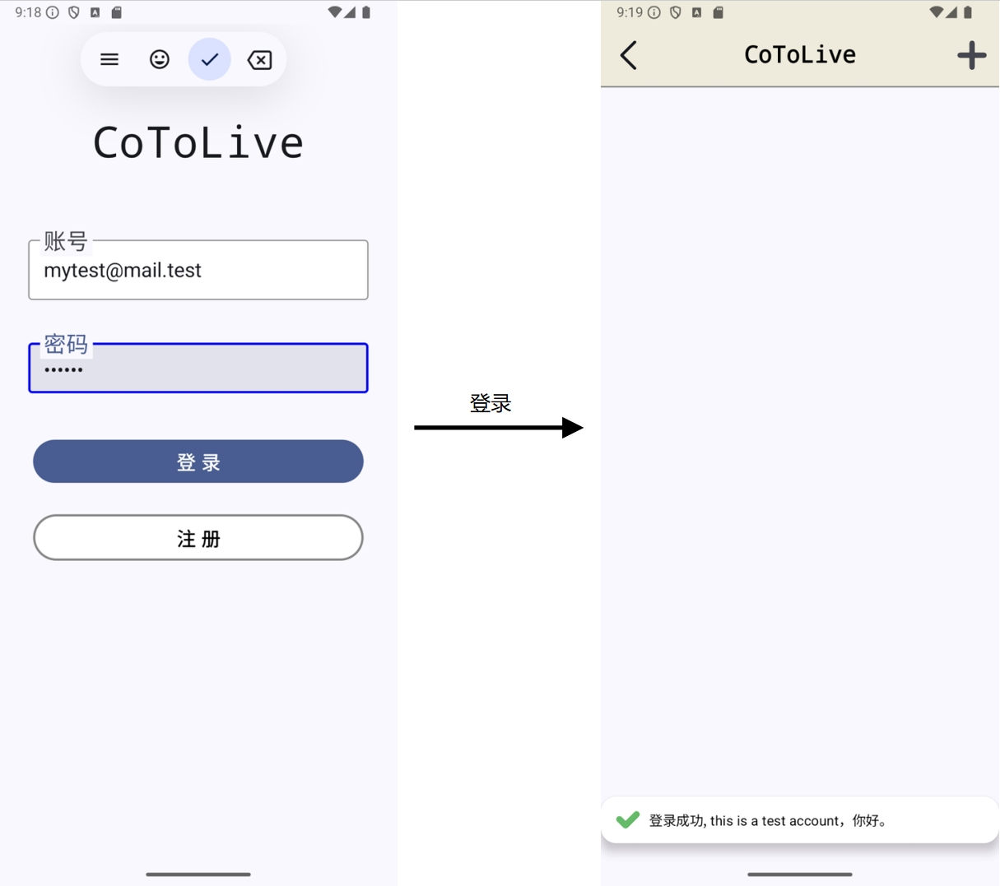

### 创建笔记
用户点击 “+”，创建笔记，创建完成后点击 “上传” 的 cloud 按钮。

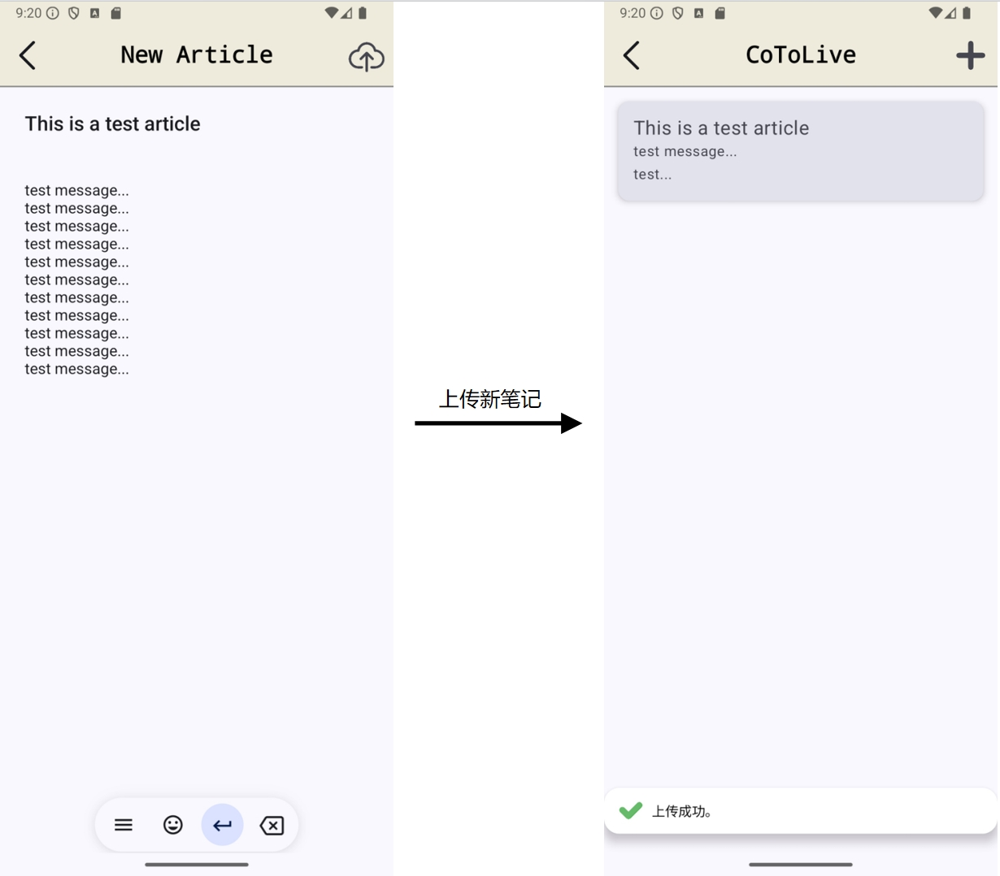

### 修改笔记
用户点击笔记进入笔记的详情页面。点击 View 旁的眼睛按钮切换为编辑模式，即可开始编辑。

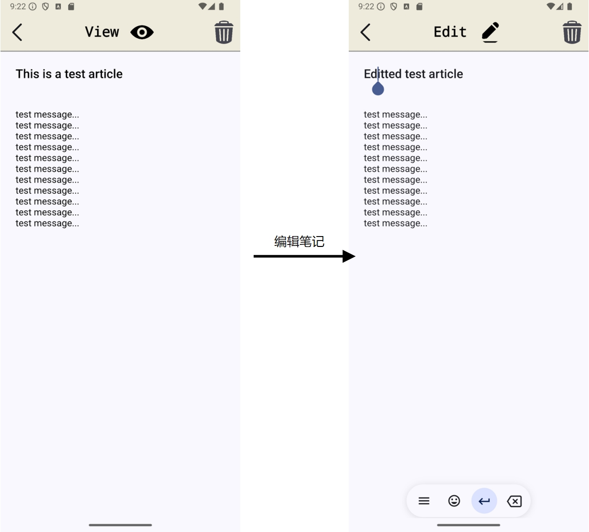

### 删除笔记
用户点击垃圾桶图标即可删除。

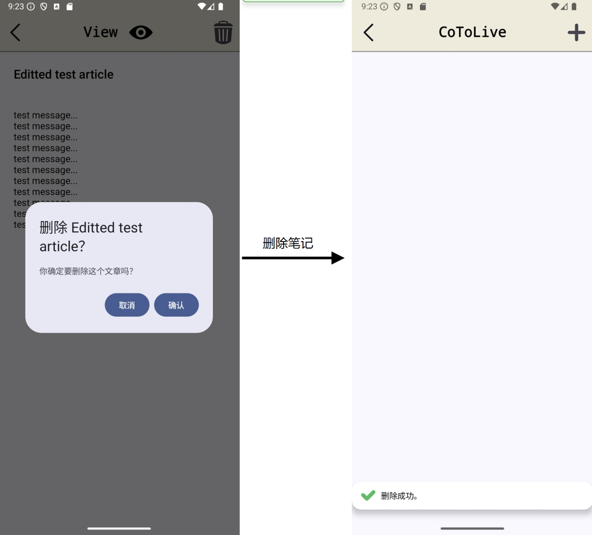


## 程序概要设计
本产品的设计分为前端和后端。
- 前端主要负责页面的显示与排版布局，并且将用户提交的请求通过**网络**发送给后端；
- 后端主要负责处理前端发送来的**网络请求**。对那些合法的请求，后端将会把数据保存在**数据库**中。


### 前端设计
本产品的前端使用 Kotlin 语言和 Jetpack Compose 框架开发。

在设计时，本产品将前端部分按照功能分为了如下几个 packages：
- `screen` screen 包含了 5 个主要页面的 UI 布局。
- `network` network 定义了网络请求的格式和 API 路径。
- `viewmodels`viewmodels 包含了若干个 view models，用来管理各种状态。
- `snackBar` snackBar 描述了提示弹窗 snackBar 的行为。
- `navigation` navigation 描述了页面跳转的逻辑。

#### Screen UI 设计
5 个 Screens 的 UI 设计如下：
- LogInScreen：登录页面的布局，用户以这个页面作为入口登录。
- SignUpScreen：注册页面的布局，用户可以在这个页面进行注册。
- HomeScreen：Home 页面的布局，这个页面将展示用户的所有笔记的摘要。
- EditScreen：查看 & 编辑页面的布局，这个页面展示某一个笔记的具体内容并且提供了编辑操作。
- NewPostScreen：创建页面的布局，这个页面用于创建一个新的笔记。


<div style="display: flex; flex-wrap: wrap; justify-content: space-between;">
    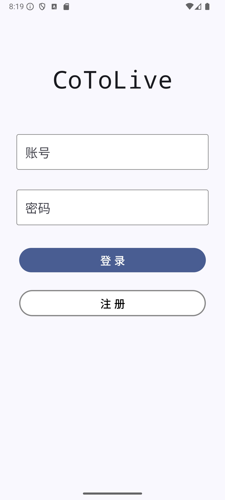
    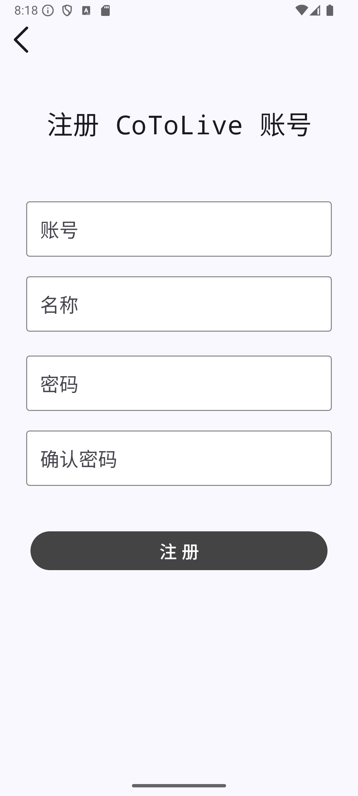
    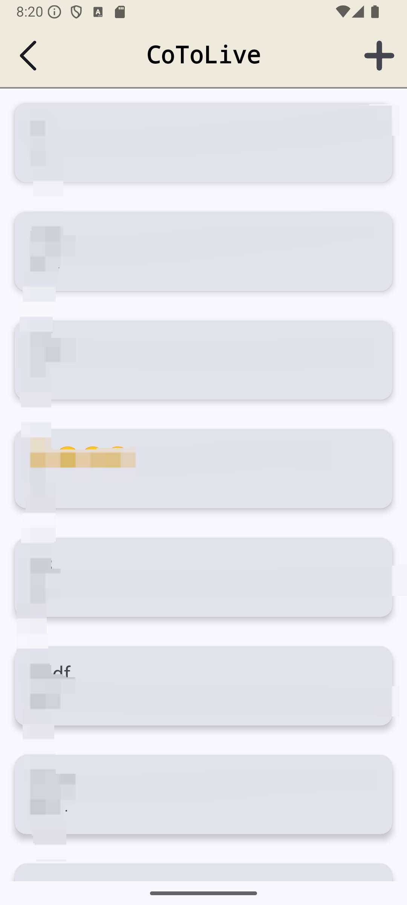
</div>
<div style="display: flex; justify-content: center; width: 100%; margin-top: 10px; flex-wrap: wrap;">
    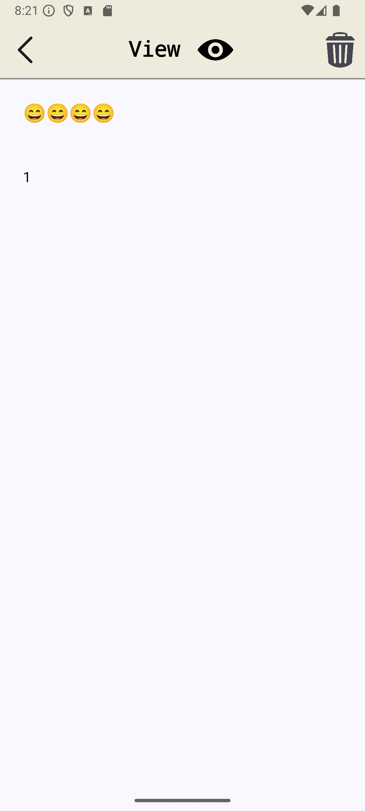
    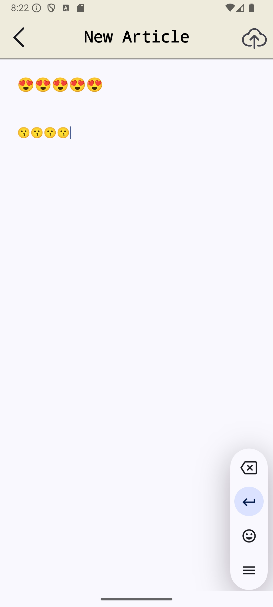
</div>


从上到下，从左到右分别是：LogInScreen、SignUpScreen、HomeScreen、 EditScreen 和 NewPostScreen。这些 screens 的 UI 均在 screen 包内定义。

#### Network 网络请求设计
在本产品中，前端需要向后端发送网络请求。本产品借助 Retrofit 来实现这一功能。

network 包中有如下两类文件：
    - {messageType}DataClass：这一类文件用来定义网络请求与响应的格式 messageType。
    - CoToLiveApiService：定义了 API 路径，并且使用 retrofit 来向后端发送消息。

发送网络请求的主要逻辑在 `CoToLiveApiService.kt` 文件中。它通过创建 Retrofit 实例、定义 Retrofit 接口来提供 Retrofit 服务。
在设计时，只要将 `CoToLiveApiService` 这一接口中的 API 路径与请求格式，与后端照应即可。

```Kotlin
// 代码位于 CoToLive\app\src\main\java\com\example\cotolive\network\CoToLiveApiService.kt

// 定义 Retrofit 接口
interface CoToLiveApiService {
    @POST("SignUp")
    suspend fun usrSignUp(@Body signUpReq: SignUpRequestMessage): SignUpPostMessage

    @POST("LogIn")
    suspend fun usrLogIn(@Body logInReq: LogInPostMessage): LogInResponseMessage

    @GET("/UserPage/GetArticleAbstract")
    suspend fun articleAbstractsFetch(): ArticleAbstractResponseMessage

    @GET("/UserPage/ReadArticle")
    suspend fun articleRead(@Query("ArticleID") articleID: Int): ArticleResponseMessage

    @PUT("/UserPage/ModifyArticle")
    suspend fun articleModify(@Body article: ArticleSent): ArticlePostResponseMessage

    @POST("/UserPage/PostArticle")
    suspend fun articlePost(@Body article: ArticleSent): ArticlePostResponseMessage

    @POST("/UserPage/DeleteArticle")
    suspend fun articleDelete(@Body articleDelId: ArticleDel): ArticlePostResponseMessage
}
```

**API 路径也会在后端设计中提到。**[跳转后端设计](#后端设计)

#### View Models 设计
View model 用于存储和管理 UI 组件所需要的数据，它能够实现业务逻辑与 UI 层解耦。本产品的前端设计中，view model 主要被用来处理网络请求，包括网络请求的发起以及后端响应的处理。通过 view model，前端能够正确地发送网络请求，并且针对后端响应执行不同的操作。

以 LogInViewModel.kt 为例，view model 在其中负责发送用户登录请求，并且接收处理后端的响应。

```Kotlin
// 代码位于 CoToLive\app\src\main\java\com\example\cotolive\viewmodels\LogInViewModel.kt
class LogInViewModel : ViewModel() {
    var logInUiState: LogInUiState by mutableStateOf(LogInUiState.Loading)
    var logInCallCnt: Int by mutableIntStateOf(0)
        private set

    // 供外界调用的发送登录请求
    fun postUsrLogIn(mail: String, password: String) {
        viewModelScope.launch {
            val logInReqMsg = LogInPostMessage(mail, password)
            logInUiState = LogInUiState.Loading
            try {
                // 调用上一小节描述的 usrLogIn，发起登录请求，返回结果被写入 logInResponse 中
                val logInResponse = CoToLiveApi.retrofitService.usrLogIn(logInReqMsg)
                TokenManager.token = logInResponse.token
                logInUiState = LogInUiState.Success(
                    "登录成功, ${logInResponse.name}，你好。"
                )
            } catch (e: IOException) {
                // 捕获异常
                Log.e("LogInViewModel", "Network error", e)
                logInUiState = LogInUiState.Error("网络错误，请稍后再试")
            } catch (e: HttpException) {
                // 捕获异常
                Log.e("LogInViewModel", "HTTP error", e)
                // 这里可以获取到 HTTP 错误的详细信息
                val errorMessage = e.response()?.errorBody()?.string() ?: "服务器错误，请稍后再试"
                logInUiState = LogInUiState.Error(errorMessage)
            }
            logInCallCnt ++
        }
    }
}
```

**由此可见，view model 为网络请求提供了一个优雅的调用方式，其中自带了接收请求、异常处理等功能。**

#### Navigation 设计
前端采用了 NavHost 来定义跳转。代码位于 `CoToLive\app\src\main\java\com\example\cotolive\navigation\AppNavigation.kt` 文件下。

跳转的逻辑如下：
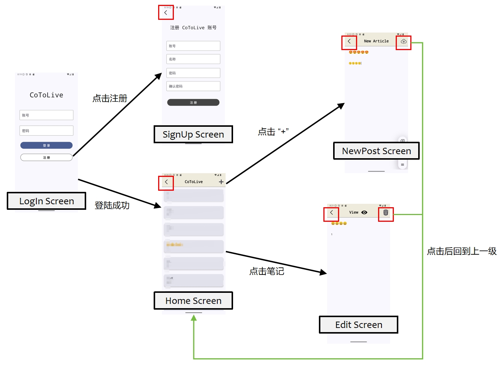

**除了上述标出的按钮之外，`<` 按钮均被实现为了 “回到上一级”**。

#### SnackBar 设计
为了给用户反馈，本产品需要利用一个弹窗来显示请求是否成功。
弹窗不应该被 screens 包含，**因为发生屏幕跳转时，弹窗会随着屏幕一起消失**，这就无法提醒用户操作是否成功。

因此，本产品的前端使用了一个 SnackBar 来设置一个位于 screens 之外的弹窗，并且通过 view model 来管理它的状态。

```Kotlin
// 代码位于 CoToLive\app\src\main\java\com\example\cotolive\snackBar\SnackBarViewModel.kt
class SnackbarViewModel : ViewModel() {
    // 控制是否显示 Snackbar
    var showSnackbar by mutableStateOf(false)
    var isCorrect by mutableStateOf(false)
    var snackbarMessage by mutableStateOf("")

    // 显示 Snackbar 的方法
    fun showOKSnackbar(message: String) {
        isCorrect = true
        snackbarMessage = message
        showSnackbar = true
    }

    fun showErrSnackbar(message: String) {
        isCorrect = false
        snackbarMessage = message
        showSnackbar = true
    }

    // 隐藏 Snackbar
    fun hideSnackbar() {
        showSnackbar = false
    }
}
```

当需要弹窗时，只需要调用 SnackbarViewModel 的 showOKSnackbar 或者 showErrSnackbar 方法即可。


### 后端设计
本产品的后端使用了 Go 语言开发，基于 **Gin 框架** 构建了 RESTful APIs，从而向前端提供 Web 服务。此外，本产品使用了 **Gorm 库** 的对象关系映射操作来访问后端的 **MySql** 数据库。

#### MySql 数据库的设计
本产品在 MySql 中构建了两个表，分别如下：
- `users`
    |列名|类型|Key|
    |-|-|-|
    |user_uid | int |PRI|
    |user_name | varchar(255)|	
    |user_mail | varchar(45) |UNI|	
    |passwd_hash | char(60) ||		
    |create_time | datetime ||

- `articles`
    |列名|类型|Key|
    |-|-|-|
    |article_id | int |PRI|
    |belongsto_uid | int |Foreign|
    |title | varchar(45) ||	
    |data_content | text ||	

其中，`user_uid` 和 `article_id` 分别是 表 `users` 和 表 `articles` 的主键。
`belongsto_uid` 是外键，它被用于表示该 article 归属于哪一个 user。

为了加速操作，本产品的后端数据库在设计时，根据当前的业务需求，除了主键之外，还为以下键设计了索引：
- `user_mail`
    由于 `user_mail` 是 UNIQUE 的键，所以将 user_mail 设置为索引可以更好地进行邮箱查重和登录操作。

- `belongsto_uid`
    由于每个 user 仅可见自己所持有的 articles，所以将 `belongsto_uid` 设为索引，可以快速找到某个 user 的所有 articles。

#### 程序与数据库的交互

利用 gorm 库，后端的 Go 语言代码可以通过对象关系映射，便捷地对数据库进行增删改查。

以 articles 这个表为例，只需要在定义 Go 的数据结构时，用 `gorm:"column:{column_name}"` 指定这个数据结构字段对应的 column_name 即可。

```Go
// 代码位于 colv-backend\sqldb\sql.go
type MysqlDB struct {
	DB *gorm.DB
}

// 代码位于 colv-backend\sqldb\sql_article.go
type Article struct {
	AID          uint   `gorm:"primaryKey;column:article_id"`
	BelongsToUID uint   `gorm:"column:belongsto_uid"`
	Title        string `gorm:"column:title"`
	Data         string `gorm:"column:data_content"`
}
```

定义了上述的数据结构之后，就可以利用 gorm 库查询数据了。以下面的代码为例，通过 Table 指定表名后，再通过 Where 查询特定的 article 即可。

```Go
// 代码位于 colv-backend\sqldb\sql_article.go
var articleFromDB Article
result := db.DB.
    Table(articleTableName).
    Where("article_id = ?", article_id).
    First(&articleFromDB)
```

#### 网络 APIs
完成了后端与数据库的连接交互之后，就可以开始设计网络的 APIs 了。
使用 Gin 框架，后端的程序可以向外提供这些接口，在文件 `colv-backend\router\handlers.go` 中，定义了如下接口。

请求类型 | API 路径|作用|
|- | - |-|
POST| `/LogIn`|处理登录请求|
POST| `/SignUp`|处理注册请求|
GET|`/UserPage/GetArticleAbstract`|获取某个 user 的所有 articles，返回摘要|
POST|`/UserPage/PostArticle`|处理 article 新建请求|
GET|`/UserPage/ReadArticle`|获取一个 article 的完整数据|
PUT|`/UserPage/ModifyArticle`|处理 article 修改请求|
POST|`/UserPage/DeleteArticle`|处理 article 删除请求|

这样，前端只需要访问对应的 API 路径，后端即可在检查请求合法性之后，进行对应的操作了。


## 软件架构图
本软件的架构图如下：
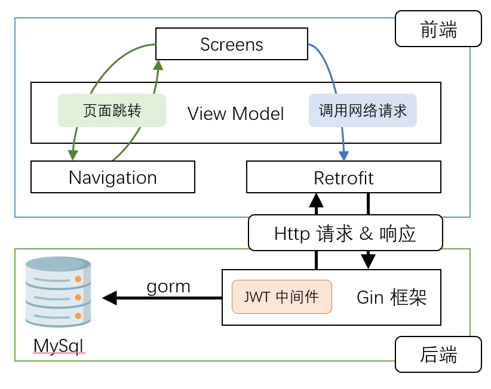

## 技术亮点及其实现原理

### 前后端用网络请求通信，支持跨设备同步
本产品的数据全部存储于后端数据库，所以用户只需要记住账号密码，即可跨设备进行数据同步。

这是由于本产品的前后端进行了分离，数据存储工作全部交给了后端，当前端需要数据时会向后端发起网络请求。

```Kotlin
// 代码位于 CoToLive\app\src\main\java\com\example\cotolive\network\CoToLiveApiService.kt

// 创建 Retrofit 实例
val retrofit = Retrofit.Builder().build()

interface CoToLiveApiService {
    @POST("SignUp")
    suspend fun usrSignUp(@Body signUpReq: SignUpRequestMessage): SignUpPostMessage
    // 设置 API 接口，省略类似的定义
    // ......
}

// 单例对象，用于提供 Retrofit 服务
object CoToLiveApi {
    val retrofitService: CoToLiveApiService by lazy {
        retrofit.create(CoToLiveApiService::class.java)
    }
}
```

通过定义上述接口，前端可以使用 Retrofit 向后端发送请求并获取数据。


### 使用 Json Web Token (JWT) 进行鉴权
由于本产品的存储操作基本上全依赖于后端数据库，所以前端需要**经常与后端发生交互**。
而我们在后端提供的是 *RESTful APIs*，它的一大特点是 stateless，即无状态性。
这意味着如果不使用鉴权的话，用户进行每一个操作时，前端都需要发送自己的账号和密码，而后端也需要反复地查表验证账号的正确性，这不仅浪费网络资源而且耗费了一定的时间，影响了程序的可扩展性。

所以本产品使用了 **Json Web Token** 进行**鉴权**。
确切来说，用户会在初次登录之后，后端会生成一个 Token，返回给前端，而前端会保存这个 Token。在前端发起的后续请求（如 `GetArticleAbstract`、`PostArticle` 等）中，消息头会带上 Authentication 字段，并且值被设置为 Token。后端在收到请求后，会先进行 JWT 认证，确认该消息是否正确，并且从中提取出用户的 ID，以便后续执行。

#### JWT 后端实现
在后端中，JWT 的代码位于 `colv-backend\router\jwt_verify.go` 文件下。该文件夹包含了 `GenerateToken` 和 `JWTAuthMiddleware` 两个函数。
- `GenerateToken` 被用于生成 Token，Token 记录了用户的 UID 并且会被设置一个过期时间。
- `JWTAuthMiddleware` 作为中间件，用来处理后端接收到的网络请求。它会检查 Token 是否过期，并且输出用户的 UID。

在后端的代码中，Gin 框架中的这几个 API 被加入了中间件 `JWTAuthMiddleware`。

```Go
// 代码位于 colv-backend\router\handlers.go 中的 GinStart() 函数中
func GinStart() {
    // ......
    // 以下 5 个 APIs 使用了 中间件 认证 JWT。
	r.GET("/UserPage/GetArticleAbstract", JWTAuthMiddleware(), dbh.HandleArticleAbstractRead)
	r.POST("/UserPage/PostArticle", JWTAuthMiddleware(), dbh.HandleArticlePost)
	r.GET("/UserPage/ReadArticle", JWTAuthMiddleware(), dbh.HandleArticleRead)
	r.PUT("/UserPage/ModifyArticle", JWTAuthMiddleware(), dbh.HandleAriticleModify)
	r.POST("/UserPage/DeleteArticle", JWTAuthMiddleware(), dbh.HandleAriticleDelete)
    // ......
}
```

#### JWT 前端实现
为了支持 JWT，前端使用一个类 TokenManager 对 Token 进行管理，当收到来自于后端的登陆成功信息（附带了后端发来的 Token）时，TokenManager 会更新 Token。

```Kotlin
// 代码位于 CoToLive\app\src\main\java\com\example\cotolive\viewmodels\LogInViewModel.kt
    val logInResponse = CoToLiveApi.retrofitService.usrLogIn(logInReqMsg)
    // 更新 Token
    TokenManager.token = logInResponse.token
```

在 TokenManager 更新了 Token 之后，前端使用了**拦截器**对之后的请求头作添加处理，这样发起网络请求时可以附带上 token，免去了重复发送账号密码的繁琐操作。

```Kotlin
// 代码位于 CoToLive\app\src\main\java\com\example\cotolive\network\CoToLiveApiService.kt

class AuthenticationInterceptor : Interceptor {
    override fun intercept(chain: Interceptor.Chain): Response {
        // 获取全局 token
        val token = TokenManager.token

        // 如果 token 存在，则在请求头中附加 Authorization
        val newRequest = if (token != null) {
            chain.request().newBuilder()
                .addHeader("Authorization", "$token")  // 添加 Authorization 头
                .build()
        } else {
            chain.request()  // 如果没有 token，直接发出请求
        }
        return chain.proceed(newRequest)  // 继续执行请求
    }
}

// 创建 OkHttpClient 并添加拦截器
val client = OkHttpClient.Builder()
    .addInterceptor(AuthenticationInterceptor())  // 添加认证拦截器
    .build()
```

接着便是后端收到请求，通过 JWT 进行认证，然后执行正常的处理逻辑了。
